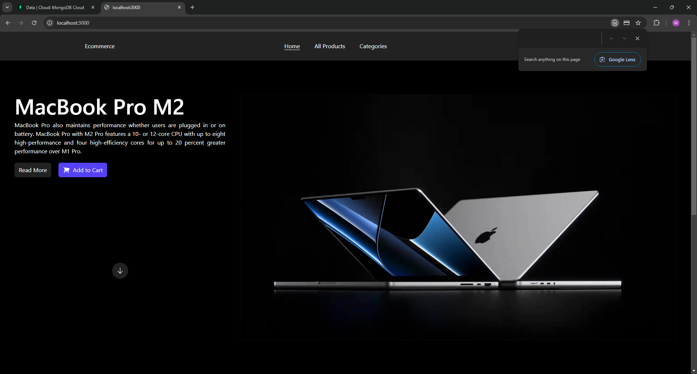
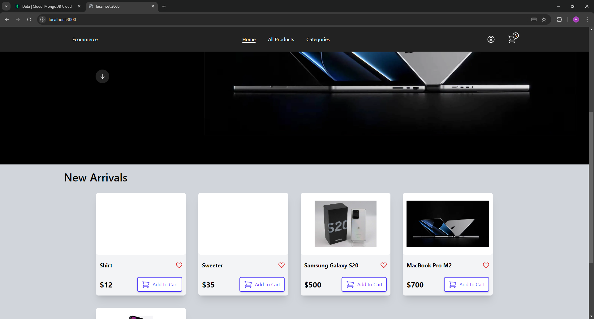
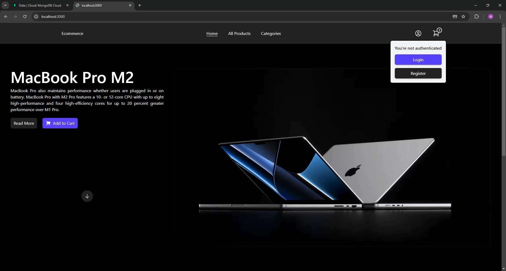
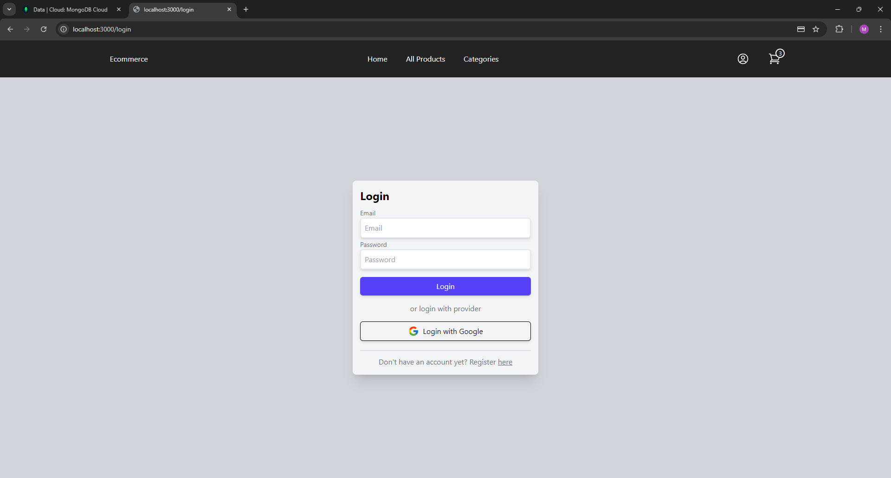
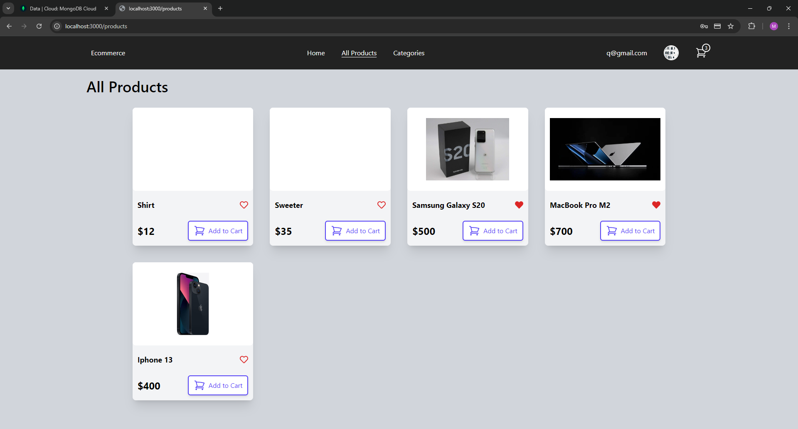
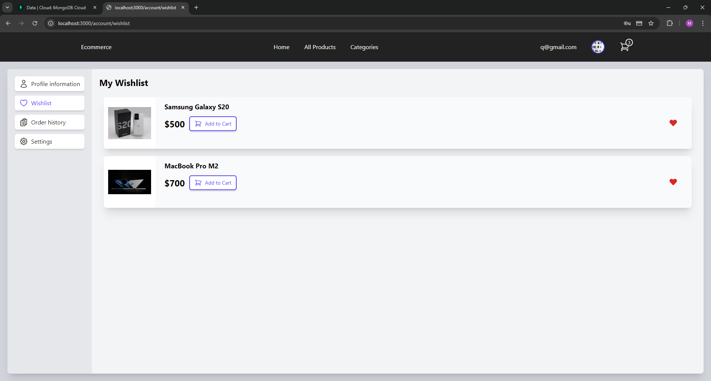
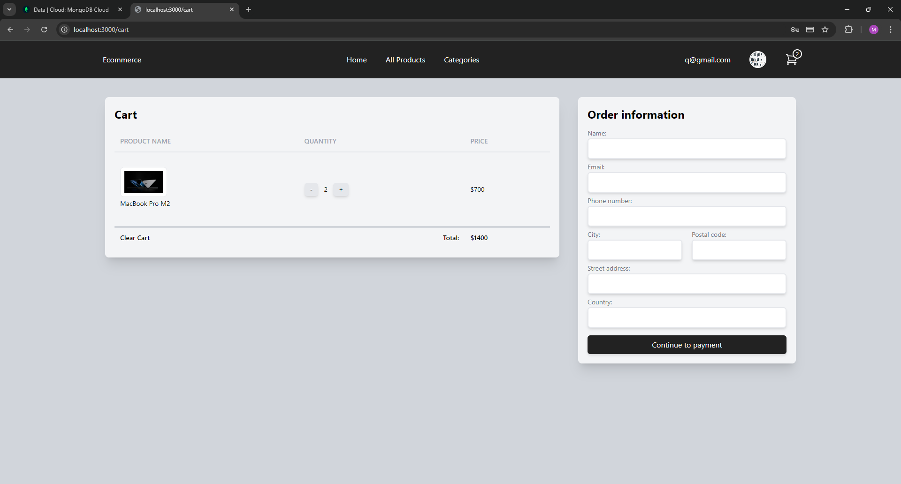
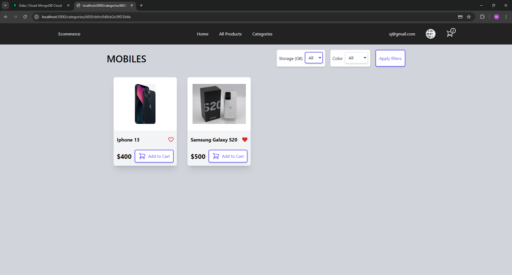
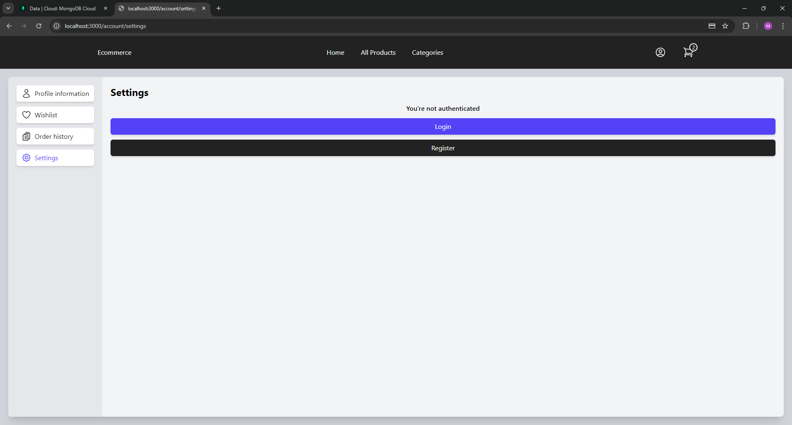

MyApp

Version: 0.1.0

Homepage: MyShop

Type: Web Application (Next.js)

Privacy: Public

Project Overview

MyShop is a fully functional e-commerce web application built using React, Next.js, and Node.js. The application allows users to browse and manage products, create and update their profile, add items to the cart, manage their orders, and process payments via Stripe. The application includes user authentication, allowing users to sign up, log in (with Google Login support), and maintain their profiles with customizable profile pictures.

Key Features

User Authentication: Sign-up, login, and logout functionalities with Google Login integration.
Product Management: Users can browse products, add them to their cart, and purchase through Stripe integration.
Profile Management: Users can update their profile information, including profile pictures.
Cart & Wishlist: Users can add products to their cart or wishlist for future purchases.
Order Tracking: Users can view and track their previous orders from the account section.
Responsive Design: A mobile-friendly design ensures accessibility across all device types.

Deployment

The project is implemented on Vercel and is available at the following link:

[See the implementation on Vercel] (https://vercel.com/michals-projects-83e62ca5/myapp)

Project Structure

myapp/

├── .next/ # Generated files by Next.js during the build (do not edit)

├── components/ # Reusable UI components

│ ├── hooks/ # Custom React hooks

│ │ ├── CartContext.js

│ │ ├── useImage.js

│ │ ├── useProfile.js

│ │ └── useWishlist.js

│ ├── icons/ # Reusable icon components

│ │ ├── CartIcon.js

│ │ ├── OrdersIcon.js

│ │ ├── ProfileIcon.js

│ │ └── SettingsIcon.js

│ ├── AccountLayout.js

│ ├── AuthButton.js

│ ├── Backdrop.js

│ ├── EditableImage.js # For editing profile pictures

│ ├── Header.js

│ ├── ProductDiv.js

│ └── Spinner.js

├── lib/ # Utility files

│ ├── mongodb.js

│ └── mongoose.js

├── models/ # Database schemas (Mongoose models)

│ ├── Category.js

│ ├── Order.js

│ ├── Product.js

│ └── User.js

├── pages/ # Next.js pages

│ ├── account/ # User account pages

│ │ ├── orders.js

│ │ ├── profile.js # User profile page

│ │ ├── settings.js

│ │ └── wishlist.js

│ ├── api/ # API routes

│ │ └── [...nextauth].js # NextAuth.js for user authentication

│ ├── index.js # Home page

│ ├── login.js # Login page

│ ├── register.js # Registration page

│ └── products/ # Dynamic product pages

├── public/ # Public assets (images, icons)

│ ├── favicon.ico

│ └── images/

├── styles/ # Global and component-specific CSS styles

│ └── globals.css

├── utils/ # Helper functions

│ └── motion.js

├── .env.example # Environment variables example

├── .eslintrc.json # ESLint configuration

├── jsconfig.json # JavaScript configuration

├── next.config.js # Next.js configuration

├── package.json # npm package configuration

└── README.md # Project documentation¨

Technologies Used

React.js: Frontend framework for building user interfaces.

Next.js: Framework for React that supports server-side rendering and static website generation.

Node.js: Backend environment to run JavaScript on the server.

MongoDB: NoSQL database used to store product, user, and order information.

Mongoose: Object Data Modeling (ODM) library for MongoDB.

Stripe: Payment gateway integration for handling payments.

Tailwind CSS: Utility-first CSS framework for styling.

NextAuth.js: Authentication library for user login and registration, with Google Login integration.

Screenshots

Features

User Authentication: Register and log in to your account, or use Google login.

Profile Management: Edit user data and upload a profile picture.

Product Browsing: Search and filter products, add items to the cart or wishlist.

Shopping Cart: Add, remove, and manage items in the cart.

Payment Integration: Seamlessly pay for orders using Stripe.

Order Management: Track previous orders through your account dashboard.

Getting Started

To get a local copy of the project up and running, follow these steps:

Prerequisites

Node.js: Install from Node.js

MongoDB: Set up a MongoDB database locally or on MongoDB Atlas.

Installation

Clone the repository:

bash

Kopier kode

git clone https://github.com/szczepanskimichal/myapp.git

Navigate to the project directory:

bash

Kopier kode

cd myapp

Install dependencies:

bash

Kopier kode

npm install

Run the development server:

bash

Kopier kode

npm run dev

The application will be available at http://localhost:3000.

Additionally, a separate repository has been created for the database, which I developed to complement this e-commerce application. The database handles all aspects of data management, including product details, user information, orders, categories, and more. It is structured using MongoDB with Mongoose models to ensure efficient data storage and retrieval. This external repository manages the back-end data architecture, providing seamless integration with the main web app.

This separation of concerns between the front-end (this repository) and the back-end (database repository) enhances modularity, making the project easier to manage, scale, and maintain.

Future Improvements

User Reviews: Allow users to leave reviews and ratings for products.

AI-based Recommendations: Implement machine learning to suggest products.

Analytics: Integrate Google Analytics for user tracking.

Author

Szczeoanski Michal

LinkedIn

GitHub

ENV EXAMPLE:

GOOGLE_ID=

GOOGLE_SECRET=

MONGODB_URI=

SECRET=

AWS_ACCESS_KEY=

AWS_SECRET_KEY=

AWS_BUCKET_NAME=

STRIPE_PK=

STRIPE_SK=

PUBLIC_URL="http://localhost:3000"
